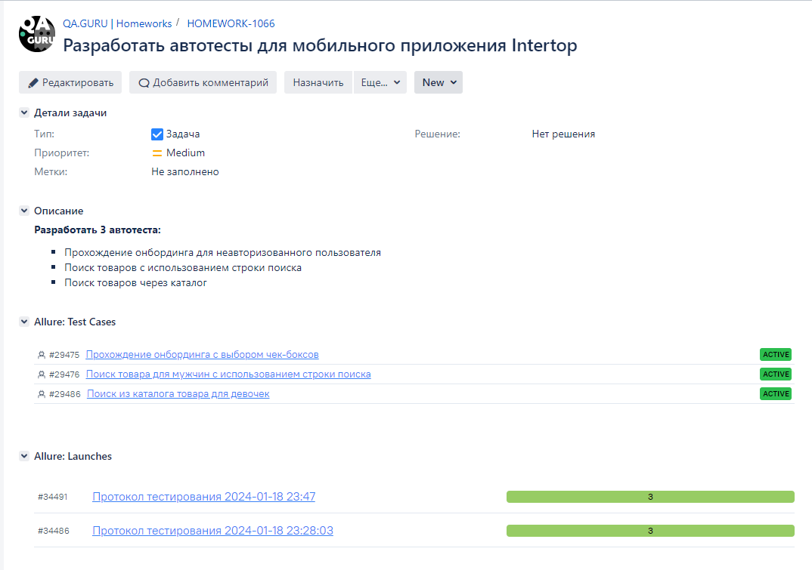

## Автоматизация тестирования мобильного приложения [Intertop](https://play.google.com/store/apps/details?id=ua.mad.intertop&hl=en_US)


----

### Инструменты и технологии, используемые в проекте
<p>
<a href="https://www.python.org/"></a>
<a href="https://docs.pytest.org/en/"></a>
<a href="https://www.jetbrains.com/pycharm/"></a>
<a href="https://www.selenium.dev/"></a>
<a href="https://github.com/yashaka/selene/"></a>
<a href="https://python-poetry.org/"></a>
<a href="https://docs.pydantic.dev/latest/"></a>
<a href="https://www.jenkins.io/"></a>
<a href="https://allurereport.org/"></a>
<a href="https://qameta.io/"></a>
<a href="https://aerokube.com/selenoid/"></a>
<a href="https://www.atlassian.com/software/jira"></a>
</p>

### Особенности проекта

* Оповещения о тестовых прогонах в Telegram
* Отчеты с видео, скриншотом, логами, исходной моделью разметки страницы
* Сборка проекта в Jenkins
* Отчеты Allure Report
* Интеграция с Allure TestOps
* Автоматизация отчетности о тестовых прогонах и тест-кейсах в Jira
* Запуск web/UI автотестов в Selenoid


### Покрываемый функционал
- Прохождение онбординга
- Поиск товаров с использованием строки поиска 
- Поиск товаров через каталог
----    

### Запуск тестов
#### По умолчанию производится запуск всех тестов *удаленно через Browserstack*
для запуска тестов через Browserstack необходимо создать файл `.env.bstack`.
Можно дополительно передать параметр:
```
--context=bstack 
```
В проекте есть пример файла `.env.bstack.example`

Для управления параметрами локального запуска необходимо создать файл `.env.local`
В проекте есть пример файла `.env.local.example`

#### Для локального запуска
1. Склонируйте репозиторий
2. Откройте проект в PyCharm
3. Введите в терминале команду

``` 
python -m venv .venv
source .venv/bin/activate
pip install poetry
pytest --context=local
```

[//]: # (### Для запуска тестов в [Jenkins]&#40;https://jenkins.autotests.cloud/job/008-o11ra-diplom/&#41;)

[//]: # ()
[//]: # (1. Открыть проект по [ссылке]&#40;https://jenkins.autotests.cloud/job/008-o11ra-diplom/&#41;)

[//]: # (2. Нажать `Build with Parameters`)

[//]: # (3. Установить параметры или оставить по-умолчнанию )

[//]: # (4. В поле "COMMENT" ввести комментарий)

[//]: # (5. Нажать `Build`)

[//]: # ()
[//]: # (![jenkins_build]&#40;resources/jenkins_choice_param.png&#41;)

[//]: # (6. Дождаться прохождения тестов)

[//]: # ()
[//]: # (![jenkins_build]&#40;resources/tests_are_running.png&#41;)

[//]: # ()
[//]: # (#### По итогу будет сформированно 2 отчета : в [Allure Report]&#40;https://jenkins.autotests.cloud/job/008-o11ra-diplom/52/allure/&#41; и [Allure TestOps]&#40;https://allure.autotests.cloud/project/3915/dashboards&#41;)

[//]: # ()
[//]: # (----)

[//]: # ()
[//]: # (### Allure-отчет)

[//]: # ()
[//]: # (Для перехода к отчету, нужно выбрать соответствующую иконку отчета:)

[//]: # ()
[//]: # ()

[//]: # ()
[//]: # (#### Пример отчета )

[//]: # ()
[//]: # (![This is an image]&#40;resources/allure_rep.png&#41;)

[//]: # ()
[//]: # (Во вклвдке `Behaviors` есть более подробная информация о этапах прохождения каждого теста, а так же прикрепленные видео, логи, скриншоты, разметка страницы)

[//]: # ()
[//]: # (![This is an image]&#40;resources/attachments.png&#41;)

[//]: # ()
[//]: # (----)

[//]: # ()
[//]: # (### Allure TestOps)

[//]: # ()
[//]: # (#### Общий список всех кейсов, имеющихся в системе)

[//]: # (![This is an image]&#40;resources/test_cases.png&#41;)

[//]: # ()
[//]: # (#### Пример dashboard с общими результатами тестирования)

[//]: # (![This is an image]&#40;resources/dashboard.png&#41;)

[//]: # ()
[//]: # (----)

[//]: # (### Интеграция с Jira)

[//]: # ()
[//]: # ([//]: # &#40;&#41;)
[//]: # ()
[//]: # (![This is an image]&#40;resources/jira.png&#41;)

[//]: # ()
[//]: # (----)

[//]: # (### Оповещение о результатах прохождения тестов в Telegram)

[//]: # ()
[//]: # ()

[//]: # ()
[//]: # (----)

[//]: # (### Пример видео прохождения автотеста "Выполнние поиска квартиры в аренду")
